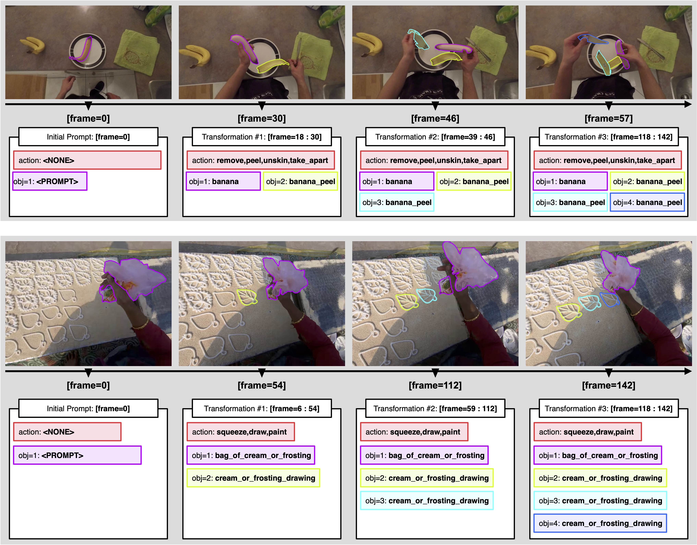

# VOST-TAS Dataset

**VOST-TAS (TrackAnyState)** is an extended version of the VOST validation set with explicit transformation annotations for tracking and understanding object state changes in videos.

## Overview
VOST-TAS enables evaluation of video understanding systems on their ability to track objects through physical transformations and describe resulting state changes. The dataset contains:
- **57 video instances**
- **108 transformations**
- **293 annotated resulting objects**

Each video sequence is annotated with temporal segments corresponding to object state transformations, including action descriptions and segmentation masks for resulting objects.

## Visualization
Explore the dataset interactively using [demo.ipynb](demo.ipynb) after downloading [VOST](https://www.vostdataset.org/) and replacing `data_dir = '<DATA>/VOST'` with your own path.
```bash
jupyter notebook demo.ipynb
```

## Dataset Details
Please refer to Appendix of the manuscript([link coming soon](https://tubelet-graph.github.io/)) for more details regarding dataset construction and evaluation metrics.

## Evaluation
Please refer to [here]() for the instructions of evaluating state-graph in terms of temporal localization, semantic correctness, spatiotemporal recall, and over transformation recall.


## Citation
If you use VOST-TAS in your research, please cite:

```
@article{sun2025tracking,
  title={Tracking and Understanding Object Transformations},
  author={Sun, Yihong and Yang, Xinyu and Sun, Jennifer J and Hariharan, Bharath},
  journal={Advances in Neural Information Processing Systems},
  volume={38},
  year={2025}
}
```
